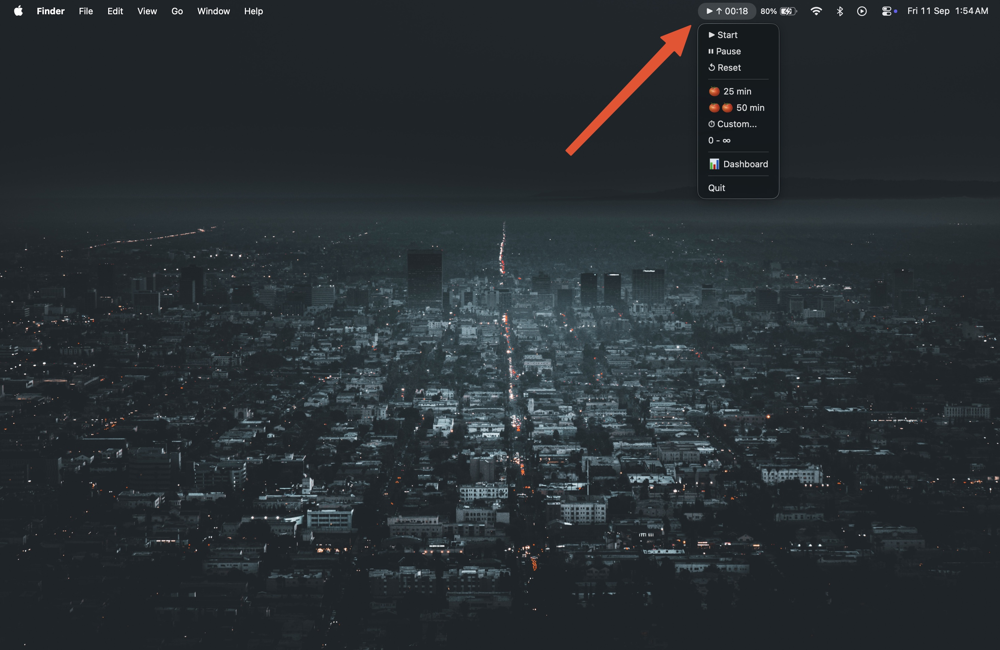

# 🍅 Chrono — Menu Bar Focus Timer for macOS

A lightweight, native macOS menu bar timer with zero Dock/cmd+tab clutter.

- **25 min 🍅** — Classic focus block
- **50 min 🍅🍅** — Long focus block
- **⏱ Custom** — Any minutes you want (30, 45, 90, whatever)
- **∞ Infinite** — Stopwatch mode (counts up)
- **Dashboard** — Weekly stats, mode breakdown, recent sessions

## Why This Exists

> **"Time you enjoy wasting is not wasted time."** — Until you can't remember what you did for the last 3 hours.

Most of us don't have a live time counter visible while we work. We check the clock, lose focus, and suddenly it's 2 AM. The psychology is simple: **when you can see time passing, you feel urgency.** Not panic — just that gentle pressure that says *"hey, 25 minutes have gone, better make them count."*

This app puts a live, always-visible timer in your menu bar. No switching windows. No opening apps. Just a quiet, persistent reminder that time is moving — so you might as well use it.

**The catch?** Raycast extensions can't do 1-second updates. They reload on click or at best every ~10 seconds. This is a real resident process with true 1-second tick updates. It lives in your menu bar, hidden from Dock and cmd+tab, so it's there when you need it and invisible when you don't.

## Demo



Click the icon to see the dropdown with Start/Pause/Reset, mode switcher, and Dashboard.

## Features

- ✅ **Live 1-second updates** in menu bar
- ✅ **Hidden from Dock & cmd+tab** — pure menu bar agent
- ✅ **Custom timers** — any duration you want
- ✅ **Session tracking** — every session saved to `data/sessions.json`
- ✅ **Browser dashboard** — open from menu or `localhost:8765`
- ✅ **Start at login** option (still no Dock!)
- ✅ **Native macOS notifications** when timer hits 0

## Quick Start

### Prerequisites

- macOS 10.15+
- Python 3.14+ (via Homebrew: `brew install python@3.14`)

### Install

```bash
# 1. Clone
git clone https://github.com/YOUR_USERNAME/chrono.git
cd chrono

# 2. Build the .app bundle
/opt/homebrew/bin/python3.14 setup.py py2app

# 3. Run
open dist/Chrono.app
```

That's it. You'll see a 🍅 timer in your menu bar. Right-click for controls.

### Commands (add to `~/.zshrc` for aliases)

```bash
source ~/hermes-workspace/chrono/alias.sh

chrono          # Start timer (0 → ∞, auto-starts counting)
chronokill      # Quit timer
chronologin     # Enable start-at-login
chrononologin   # Disable start-at-login
```

Or just type `chrono` — defaults to `start`.

## Usage

### Menu

| Item | Action |
|---|---|
| **▶ Start** | Begin timer (auto-starts in ∞ mode) |
| **⏸ Pause** | Pause current session |
| **⏹ Stop Session** | End session, save focus time to dashboard |
| **↺ Reset** | Reset to mode default without saving |
| **🍅 25 min** | Switch to 25-min block |
| **🍅🍅 50 min** | Switch to 50-min block |
| **⏱ Custom...** | Enter any minutes (30, 45, 60, 90...) |
| **0 - ∞** | Switch to infinite stopwatch |
| **📊 Dashboard** | Open stats in browser |
| **Quit** | Save and exit |

### Start at Login

```bash
cp com.user.chrono.plist ~/Library/LaunchAgents/
launchctl load ~/Library/LaunchAgents/com.user.chrono.plist
```

Still zero Dock presence.

## Dashboard

Click **📊 Dashboard** in the menu or open `http://localhost:8765`.

Shows:
- Today's total focus time & session count
- All-time stats
- Last 7 days bar chart
- Breakdown by mode (25/50/Custom/∞)
- Recent sessions list

## Data

Sessions are stored in `data/sessions.json`:

```json
{
  "date": "2026-09-10",
  "mode": "⏱ 45 min",
  "start_time": "21:30:00",
  "end_time": "22:15:30",
  "duration": 2730,
  "duration_formatted": "45m 30s"
}
```

## Project Structure

```
chrono/
├── chrono.py            # Main app (rumps menu bar)
├── setup.py             # py2app build config
├── alias.sh             # Shell shortcuts
├── com.user.chrono.plist  # LaunchAgents auto-start
├── data/
│   └── sessions.json    # Your focus data
└── dist/
    └── Chrono.app       # Built app bundle
```

## Technical Details

- **Framework**: [rumps](https://github.com/jaredks/rumps) (Python + PyObjC)
- **UI**: macOS native `NSStatusItem` (menu bar only)
- **Activation Policy**: `LSUIElement=true` in Info.plist
- **Custom input**: Native macOS dialog via `osascript`
- **Dashboard**: Built-in HTTP server on `localhost:8765` with dark-themed HTML

## Why not Raycast?

Raycast menu-bar extensions can't do 1-second updates. They reload on click or at best every ~10 seconds. This app is a real resident process with true 1-second tick updates.

## License

MIT — use it however you want.
